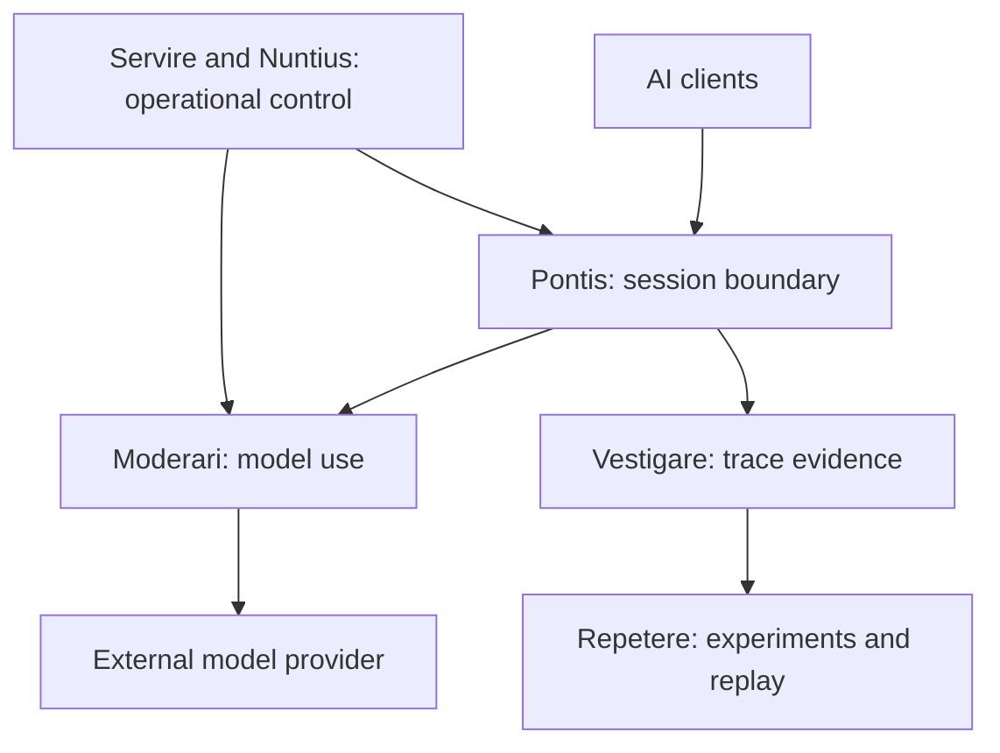

# Lumen

> **Continuity • Understanding • Provenance • Trust**

**Lumen is a model- and client-independent Reasoning Assurance Service for AI-assisted work.**

AI observability can show what happened. Lumen is being built to preserve the evidence needed to understand **why it happened, whether it can be reproduced, and whether the result is dependable enough to use**.

Lumen sits between AI clients and model providers. It coordinates sessions, model use, evidence capture and controlled replay without replacing the client, model or surrounding tools.

> **Observability tells you what happened. Lumen tells you whether it was worth it.**

---

## Why Lumen exists

Language models can reason, generate and assist exceptionally well, but their sessions are temporary and their behaviour is not perfectly repeatable.

As work grows beyond a single exchange, important context and evidence can become fragmented:

- objectives, facts and constraints;
- decisions and the reasoning behind them;
- assumptions and later corrections;
- sources, files and provenance;
- model, provider and configuration details;
- work completed and questions still unresolved;
- the relationship between a conclusion and the trace that produced it;
- the correct point from which work should continue.

A transcript alone does not provide reliable continuity or assurance. It does not necessarily establish which model ran, how it was configured, what evidence it used, whether the execution can be repeated, or how a changed answer should be interpreted.

Lumen therefore treats the **project, experiment and execution evidence**—rather than an individual conversation—as the durable basis of understanding.

---

## What Lumen provides

Lumen is designed to support four connected capabilities:

1. **Continuity** — preserve the meaningful state of work across sessions, context boundaries, clients and model changes.
2. **Observation** — capture correlated evidence about requests, responses, execution and operational state.
3. **Reproduction** — replay controlled runs in fresh sessions with sufficient model and configuration metadata to make comparisons meaningful.
4. **Assurance** — build calibrated trust from accumulated evidence rather than requiring every output to be accepted or reverified from first principles.

The immediate M0.1 research focus is:

> **Observe → Reproduce → Repeat**

Behavioural assessment is part of the wider architecture, but **Lumen Aestimare is not included in the M0.1 External Research Distribution**.

---

## How Lumen fits

The client may be Rogare, a console, an IDE, an application or an agent. The provider may be a local platform such as Ollama or another supported inference service.

Lumen does not own the external provider process. For Ollama, Lumen checks availability and manages only model residency that Lumen itself caused:

- model selection records runtime intent;
- the first ask loads the selected model when required;
- active execution sessions reserve that model;
- the final dependent session may release a model loaded by Lumen;
- a model already resident before Lumen used it is left untouched.

This separation keeps provider infrastructure independent while allowing Lumen to enforce a coherent model choice across active work.

---

## Service architecture

Lumen is implemented as a set of services with explicit ownership boundaries.

| Service | Responsibility |
| --- | --- |
| **Rogare** | Research and session interface, including model selection during session establishment. |
| **Pontis** | Client boundary and authority for session lifecycle, selected-model enforcement and request correlation. |
| **Moderari** | Orchestrates how the selected model is used, including prompts and tool behaviour. |
| **Praebere** | Discovers providers and models; owns runtime-global model selection, reservation, readiness and Lumen-initiated model residency. |
| **Vestigare** | Records correlated execution traces, provenance and recording-level model metadata. |
| **Repetere** | Owns experiments, runs and controlled reproduction in fresh execution sessions. |
| **Fiducia** | Coordinates scheduled and assurance-related workflows. |
| **Servire** | Operational authority and control plane for the Lumen service group. |
| **Nuntius** | Common operational command, status and diagnostic path. |
| **Aestimare** | Behavioural assessment and evidence synthesis; part of the wider architecture, but outside M0.1. |

MongoDB provides persistence for the M0.1 service group. Services run in Docker on a private Lumen network, with Servire providing the supported operational lifecycle.

---

## Lumen Assess

Lumen Aestimare is deliberately framed as behavioural assessment rather than an intelligence benchmark:

> Lumen Assess does not attempt to determine how intelligent an AI system is. It characterises how that system behaves under controlled, repeatable conditions so that behaviour can be understood, compared and improved.

The aim is not to reduce a model to one score. Different assessors examine distinct behavioural dimensions, while Aestimare relates their findings to the execution evidence captured elsewhere in Lumen.

In short:

> **Assess measures behaviour, not intelligence.**

---

## What Lumen is—and is not

Lumen is not:

- a language model;
- a replacement for an AI client or coding agent;
- a model provider;
- a conventional chat-history store;
- a claim that model output is automatically correct.

Lumen does not make a model inherently more intelligent. It provides infrastructure for preserving context, correlating evidence, reproducing behaviour and supporting informed human judgement.

Its purpose is not merely to remember more text. Its purpose is to preserve enough **meaning, state, execution evidence and provenance** for AI-assisted work to remain coherent and defensible.

---

## Design principles

- **Model independent** — models can change without redefining the assurance architecture.
- **Client independent** — Lumen is not tied to one console, IDE, application or agent framework.
- **Provider neutral** — provider lifecycle and capability are isolated behind an explicit boundary.
- **Persistent** — important project, experiment and execution state survives individual sessions.
- **Observable** — interactions and state transitions can be inspected.
- **Auditable** — conclusions can be related to their reasoning, configuration and provenance.
- **Evidence based** — assurance is built from recorded behaviour rather than assertion.
- **Repeatable** — controlled replay makes behavioural comparison possible.
- **Fail-fast** — invalid dependencies, model conflicts and unsafe assumptions are rejected early.
- **Human accountable** — evidence supports human judgement; it does not disguise or remove responsibility.
- **Practical** — engineering usefulness and operational trust take priority over benchmark theatre.

---

## M0.1 External Research Distribution

M0.1 is the first defined external research distribution of Lumen. It is intended for bounded, independent research rather than general production deployment.

The distribution comprises:

- Rogare;
- Pontis;
- Moderari;
- Praebere;
- Vestigare;
- Repetere;
- Fiducia;
- Servire;
- Nuntius;
- MongoDB.

The supported installation is a single-machine Docker deployment on a private Lumen network. Servire is the operational authority; directly starting protected services is not the supported runtime model.

M0.1 remains active engineering work. The repository should not be interpreted as a finished, generally available product or as a promise that every documented future capability is already implemented.

---

## Current development

Current work is concentrated on making the first external research workflow dependable:

- recording model identity and configuration with execution evidence;
- persisting experiments and individual runs;
- creating a fresh Pontis execution session for each replay run;
- validating and reserving the selected model before execution;
- correlating replay runs with child traces;
- supporting multiple active sessions without mixing their evidence;
- preserving provider-neutral, lazy model readiness;
- improving failure reporting, operational diagnostics and recovery.

Later work extends these foundations into richer behavioural assessment through Aestimare.

---

## Documentation

The repository contains the public architecture, research, engineering record and development direction for Lumen.

Start with:

- [Documentation index](docs/README.md)
- [Canonical Lumen architecture](docs/architecture/core/ARCHITECTURE.md)
- [Current ecosystem architecture](docs/architecture/ecosystem/LUMEN_ECOSYSTEM_CURRENT_ARCHITECTURE.md)
- [Canonical service matrix](docs/architecture/ecosystem/LUMEN_SERVICE_MATRIX.md)
- [Engineering Diary](docs/engineering/ENGINEERING_DIARY.md)

Historical milestone notes, evidence and research documents remain valuable records, but they may describe earlier architecture. Where documents conflict, the canonical architecture and service matrix define the current service boundaries.

---

## Licensing and availability

No general community software licence has yet been published.

This repository makes Lumen's architecture, research and development record available for examination. The M0.1 software distribution is planned as a separately authorised, research-only release with defined usage and redistribution restrictions.

An **Illuminates Community License** and an **Illuminates Commercial License** remain planned for later software availability.

---

## Contributions and feedback

Discussion, research interest and constructive feedback are welcome.

Formal code contributions are not currently being accepted while the architecture and first external research distribution continue to evolve. A contribution process will be introduced when the project reaches an appropriate level of maturity.

---

## About Illuminates.One

Lumen is developed by **Illuminates.One**.

Illuminates.One creates tools that help people discover, preserve and build upon knowledge. Continuity, provenance, understanding and engineering trustworthiness underpin that work.

Lumen embodies that philosophy by building the evidence and continuity infrastructure required for AI-assisted engineering and knowledge work to remain coherent, observable and dependable over time.

**We illuminate knowledge.**

---

<strong>RERI · AESTIMARE · SERVIRE</strong>

